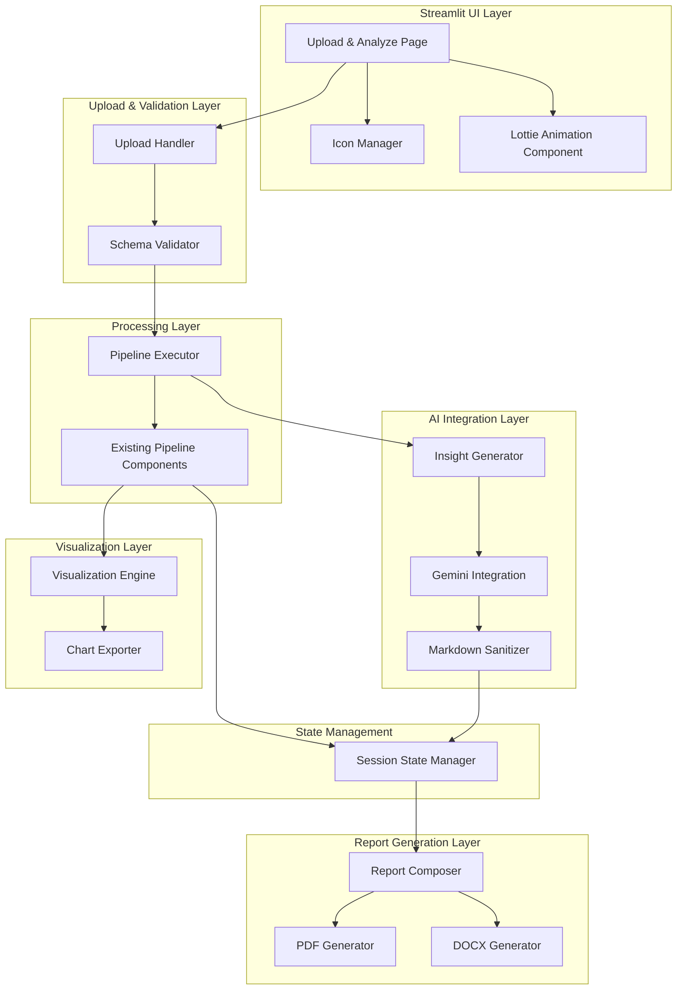

# Design Document: AI-Powered Dataset Upload and Reporting

## Overview

This design document specifies the technical architecture for adding AI-powered dataset upload, processing, and reporting capabilities to the existing customer segmentation system. The enhancement enables users to upload custom CSV datasets, automatically execute the complete segmentation pipeline, receive AI-generated insights via Google Gemini API, visualize results with advanced interactive charts, and generate professional reports in PDF and DOCX formats.

The system integrates seamlessly with existing pipeline components (data ingestion, validation, transformation, feature engineering, clustering, supervised learning) while adding new layers for AI insight generation, advanced visualization, and report production. Additionally, the system replaces emoji-based icons with a professional icon system and resolves Lottie animation rendering issues.

### Key Design Goals

1. **Reusability**: Leverage existing pipeline components without duplication
2. **Modularity**: Separate concerns for upload handling, AI integration, visualization, and reporting
3. **Reliability**: Graceful error handling with clear user feedback at each stage
4. **Performance**: Process datasets up to 100MB and 10,000 rows within acceptable timeframes
5. **Security**: Sanitize AI-generated content, validate uploaded data, secure API credentials
6. **User Experience**: Professional dark-themed UI with progress indicators and intuitive workflows

## Architecture

### High-Level Component Architecture



### System Context

The feature integrates with the existing customer segmentation system built with:
- **Language**: Python 3.11+
- **UI Framework**: Streamlit with dark theme customization
- **ML Pipeline**: Modular components in `src/` (data, features, models, pipeline, evaluation, explainability)
- **Data Processing**: pandas, numpy for data manipulation
- **ML Libraries**: scikit-learn, XGBoost, LightGBM, CatBoost, HDBSCAN for clustering/classification
- **Visualization**: matplotlib, seaborn, plotly for charting
- **Configuration**: YAML-based configuration system

### Data Flow

1. **Upload Phase**: User uploads CSV → Upload Handler validates file size/format → Schema Validator checks structure
2. **Processing Phase**: Pipeline Executor orchestrates existing components → Progress updates to Session State
3. **Insight Generation Phase**: Results sent to Gemini API → AI-generated insights returned → Markdown sanitized
4. **Visualization Phase**: Visualization Engine generates interactive Plotly charts → Charts stored in Session State
5. **Report Generation Phase**: Report Composer assembles content → PDF/DOCX generators produce output files

## Components and Interfaces

### 1. Icon Manager

**Purpose**: Replace emoji-based icons with professional icon library throughout the application.

**Technology**: `streamlit-icons` library or Material Icons embedded via HTML/CSS

**Interface**:
```python
class IconManager:
    """Manages professional icon display across the UI."""
    
    @staticmethod
    def get_icon(name: str, size: str = "md", color: str = "#00d2ff") -> str:
        """
        Returns HTML/markdown for a professional icon.
        
        Args:
            name: Icon identifier (e.g., "home", "upload", "chart", "download")
            size: Icon size ("sm", "md", "lg", "xl")
            color: Hex color code for icon
            
        Returns:
            HTML string or icon component for rendering
        """
        pass
    
    @staticmethod
    def render_icon_button(icon: str, label: str, key: str) -> bool:
        """
        Renders a button with an icon.
        
        Args:
            icon: Icon name
            label: Button label text
            key: Unique Streamlit key
            
        Returns:
            True if button clicked, False otherwise
        """
        pass
```

**Icon Mappings** (emoji → professional icon):
- 🏠 → home/dashboard icon
- 📊 → chart-bar icon
- 🔍 → search/magnify icon
- 🎯 → target icon
- 🤖 → robot/ai icon
- 💡 → lightbulb icon
- ⬆️ → upload icon
- ⬇️ → download icon
- 🔧 → settings/tool icon

### 2. Lottie Animation Component

**Purpose**: Reliable rendering of sidebar animations with fallback support.

**Technology**: `streamlit-lottie` library with enhanced error handling

**Interface**:
```python
class LottieComponent:
    """Handles Lottie animation rendering with fallback."""
    
    def __init__(self, animation_url: str, fallback_icon: str):
        """
        Initialize with animation URL and fallback icon.
        
        Args:
            animation_url: URL to Lottie JSON file
            fallback_icon: Icon name to display if animation fails
        """
        self.animation_url = animation_url
        self.fallback_icon = fallback_icon
        self.animation_data = None
        
    def load(self, timeout: int = 2) -> bool:
        """
        Load animation data with timeout.
        
        Args:
            timeout: Maximum seconds to wait for animation load
            
        Returns:
            True if loaded successfully, False otherwise
        """
        pass
    
    def render(self, height: int = 200, key: str = "lottie") -> None:
        """
        Render animation or fallback.
        
        Args:
            height: Animation height in pixels
            key: Unique Streamlit key
        """
        pass
```

**Implementation Strategy**:
- Attempt to load animation with 2-second timeout
- Cache loaded animation data in Streamlit session state
- If load fails, render fallback static icon from IconManager
- Ensure smooth 30+ FPS playback by using optimized Lottie JSON files

### 3. Upload Handler

**Purpose**: Accept and parse CSV file uploads with robust error handling.

**Interface**:
```python
from dataclasses import dataclass
from typing import Optional
import pandas as pd

@dataclass
class UploadResult:
    """Result of CSV upload operation."""
    success: bool
    dataframe: Optional[pd.DataFrame]
    error_message: Optional[str]
    file_info: dict  # size, name, rows, columns

class UploadHandler:
    """Handles CSV file uploads and parsing."""
    
    MAX_FILE_SIZE_MB = 100
    
    @staticmethod
    def accept_upload() -> Optional[UploadResult]:
        """
        Display file uploader and parse uploaded CSV.
        
        Returns:
            UploadResult with dataframe or error message
        """
        pass
    
    @staticmethod
    def parse_csv(uploaded_file) -> pd.DataFrame:
        """
        Parse CSV file with encoding fallback.
        
        Args:
            uploaded_file: Streamlit UploadedFile object
            
        Returns:
            Parsed dataframe
            
        Raises:
            ValueError: If parsing fails with descriptive message
        """
        pass
```

**Parsing Logic**:
1. Check file size ≤ 100MB
2. Attempt UTF-8 encoding
3. Fallback to latin-1 if UTF-8 fails
4. Detect delimiter automatically (comma, tab, semicolon)
5. Handle quoted fields and escaped characters
6. Return parsed DataFrame or descriptive error

### 4. Schema Validator

**Purpose**: Validate uploaded data structure and quality before processing.

**Interface**:
```python
from dataclasses import dataclass, field
from typing import List, Dict, Any

@dataclass
class ValidationResult:
    """Result of schema validation."""
    passed: bool
    errors: List[str] = field(default_factory=list)
    warnings: List[str] = field(default_factory=list)
    summary: Dict[str, Any] = field(default_factory=dict)
    column_mapping: Dict[str, str] = field(default_factory=dict)

class SchemaValidator:
    """Validates uploaded dataset structure and quality."""
    
    MIN_NUMERIC_FEATURES = 3
    MAX_NULL_RATIO = 0.5
    
    def __init__(self, dataframe: pd.DataFrame):
        """Initialize with uploaded dataframe."""
        self.df = dataframe
        
    def validate(self) -> ValidationResult:
        """
        Run all validation checks.
        
        Returns:
            ValidationResult with pass/fail status and details
        """
        pass
    
    def _check_minimum_features(self) -> List[str]:
        """Check for at least MIN_NUMERIC_FEATURES numeric columns."""
        pass
    
    def _check_null_ratios(self) -> List[str]:
        """Check for excessive missing values per column."""
        pass
    
    def _detect_data_types(self) -> Dict[str, str]:
        """Detect and report data types for each column."""
        pass
    
    def suggest_column_mapping(self) -> Dict[str, str]:
        """
        Suggest mapping of uploaded columns to expected features.
        Uses heuristics like column name similarity.
        
        Returns:
            Dictionary mapping uploaded column names to standard feature names
        """
        pass
```

**Validation Checks**:
1. Minimum rows: ≥ 100
2. Minimum numeric features: ≥ 3
3. Null ratio per column: ≤ 50%
4. Data type detection: int, float, object/categorical
5. Duplicate detection: warn if >10% duplicates
6. Outlier detection: report extreme values (outside 3 std dev)

### 5. Pipeline Executor

**Purpose**: Orchestrate the complete segmentation pipeline on uploaded data with progress tracking.

**Interface**:
```python
from enum import Enum
from dataclasses import dataclass
from typing import Callable, Optional

class PipelineStage(Enum):
    """Pipeline execution stages."""
    CLEANING = "Data Cleaning"
    FEATURE_ENGINEERING = "Feature Engineering"
    CLUSTERING = "Clustering Analysis"
    MODEL_TRAINING = "Model Training"
    EVALUATION = "Model Evaluation"

@dataclass
class PipelineProgress:
    """Progress tracking for pipeline execution."""
    stage: PipelineStage
    percent_complete: float
    message: str
    start_time: float
    
@dataclass
class PipelineResult:
    """Result of complete pipeline execution."""
    success: bool
    processed_df: pd.DataFrame
    cluster_labels: pd.Series
    clustering_report: dict
    supervised_report: dict
    selected_features: List[str]
    execution_time_seconds: float
    error_message: Optional[str] = None

class PipelineExecutor:
    """Orchestrates segmentation pipeline on uploaded data."""
    
    def __init__(self, dataframe: pd.DataFrame, config_manager: ConfigurationManager):
        """
        Initialize executor with uploaded data.
        
        Args:
            dataframe: Validated uploaded dataframe
            config_manager: Configuration manager instance
        """
        self.df = dataframe
        self.config = config_manager
        self.progress_callback: Optional[Callable[[PipelineProgress], None]] = None
        
    def set_progress_callback(self, callback: Callable[[PipelineProgress], None]):
        """Set callback function for progress updates."""
        self.progress_callback = callback
        
    def execute(self) -> PipelineResult:
        """
        Execute complete pipeline with progress tracking.
        
        Returns:
            PipelineResult with all outputs and metrics
        """
        pass
    
    def _execute_cleaning(self) -> pd.DataFrame:
        """Execute data cleaning: imputation, outlier handling."""
        pass
    
    def _execute_feature_engineering(self, df: pd.DataFrame) -> pd.DataFrame:
        """Execute feature engineering using existing FeatureEngineer."""
        pass
    
    def _execute_clustering(self, df: pd.DataFrame) -> tuple:
        """Execute clustering using existing ClusteringEngine."""
        pass
    
    def _execute_supervised(self, df: pd.DataFrame, labels: pd.Series) -> dict:
        """Execute supervised training using existing SupervisedModelTrainer."""
        pass
```

**Pipeline Integration Strategy**:
- Reuse existing components from `src.data`, `src.features`, `src.models`
- Adapt components to work with arbitrary input schemas (not just marketing_campaign.csv)
- Emit progress updates after each stage completion
- Handle errors gracefully: log errors, return partial results where possible
- Store all artifacts in session state (not file system) for transient analysis


### 6. Gemini Integration

**Purpose**: Interface with Google Gemini API for AI-generated insights.

**Technology**: Google Generative AI Python SDK (`google-generativeai`)

**Interface**:
```python
from dataclasses import dataclass
from typing import Optional, List
import time
from collections import deque

@dataclass
class GeminiConfig:
    """Configuration for Gemini API."""
    api_key: str
    model_name: str = "gemini-1.5-flash"
    temperature: float = 0.7
    max_tokens: int = 2048
    requests_per_minute: int = 10

@dataclass
class GeminiResponse:
    """Response from Gemini API."""
    success: bool
    content: str
    error_message: Optional[str] = None
    tokens_used: int = 0

class GeminiIntegration:
    """Handles communication with Google Gemini API."""
    
    def __init__(self, config: GeminiConfig):
        """
        Initialize with API configuration.
        
        Args:
            config: GeminiConfig with API key and settings
        """
        self.config = config
        self.client = None
        self.request_times: deque = deque(maxlen=config.requests_per_minute)
        self.cache: dict = {}
        
    def authenticate(self) -> bool:
        """
        Authenticate with Gemini API.
        
        Returns:
            True if authentication succeeds, False otherwise
        """
        pass
    
    def generate_insight(self, prompt: str, cache_key: Optional[str] = None) -> GeminiResponse:
        """
        Generate AI insight from prompt.
        
        Args:
            prompt: Input prompt for AI generation
            cache_key: Optional key for caching response
            
        Returns:
            GeminiResponse with generated content or error
        """
        pass
    
    def _rate_limit_check(self) -> None:
        """
        Enforce rate limiting (requests per minute).
        Blocks if rate limit would be exceeded.
        """
        pass
    
    def _retry_with_backoff(self, func, max_retries: int = 3) -> GeminiResponse:
        """
        Retry API call with exponential backoff.
        
        Args:
            func: Function to retry
            max_retries: Maximum retry attempts
            
        Returns:
            GeminiResponse from successful call or final error
        """
        pass
    
    @staticmethod
    def load_config_from_env() -> Optional[GeminiConfig]:
        """
        Load API configuration from environment variables or Streamlit secrets.
        
        Returns:
            GeminiConfig if credentials found, None otherwise
        """
        pass
```

**Rate Limiting Strategy**:
- Track timestamps of last N requests (N = requests_per_minute)
- Before new request, check if oldest request was within last 60 seconds
- If so, sleep until 60 seconds have elapsed since oldest request
- Remove oldest timestamp and add new timestamp after request

**Error Handling**:
- Invalid API key: Display clear error message, disable AI features
- Rate limit exceeded: Queue requests and process sequentially
- Transient errors (500, 503): Retry with exponential backoff (1s, 2s, 4s)
- Non-retryable errors: Log error, return fallback message

**Caching Strategy**:
- Cache responses in `st.session_state` with prompt hash as key
- Check cache before making API call
- Invalidate cache when new dataset uploaded

### 7. Insight Generator

**Purpose**: Generate business-focused natural language insights from segmentation results.

**Interface**:
```python
from dataclasses import dataclass
from typing import List, Dict, Any

@dataclass
class ClusterInsight:
    """AI-generated insight for a cluster."""
    cluster_id: int
    profile_description: str
    key_characteristics: List[str]
    business_recommendations: List[str]

@dataclass
class FeatureInsight:
    """AI-generated insight for feature importance."""
    feature_name: str
    importance_score: float
    explanation: str

class InsightGenerator:
    """Generates AI insights from segmentation results."""
    
    def __init__(self, gemini: GeminiIntegration):
        """Initialize with Gemini integration."""
        self.gemini = gemini
        
    def generate_cluster_insights(
        self, 
        cluster_profiles: Dict[int, Dict[str, Any]]
    ) -> List[ClusterInsight]:
        """
        Generate natural language insights for each cluster.
        
        Args:
            cluster_profiles: Dictionary mapping cluster IDs to profile statistics
                             (mean values, size, key features)
        
        Returns:
            List of ClusterInsight objects
        """
        pass
    
    def generate_feature_importance_insights(
        self,
        feature_importances: Dict[str, float]
    ) -> List[FeatureInsight]:
        """
        Generate explanations for top feature importances.
        
        Args:
            feature_importances: Dictionary mapping feature names to importance scores
            
        Returns:
            List of FeatureInsight objects for top 5 features
        """
        pass
    
    def generate_executive_summary(
        self,
        n_clusters: int,
        dataset_info: Dict[str, Any],
        cluster_insights: List[ClusterInsight]
    ) -> str:
        """
        Generate executive summary of segmentation results.
        
        Args:
            n_clusters: Number of segments discovered
            dataset_info: Dataset metadata (rows, columns, quality metrics)
            cluster_insights: Generated cluster insights
            
        Returns:
            Markdown-formatted executive summary (max 500 words)
        """
        pass
    
    def _build_cluster_prompt(self, cluster_id: int, profile: Dict[str, Any]) -> str:
        """Build prompt for cluster insight generation."""
        pass
    
    def _build_feature_prompt(self, features: Dict[str, float]) -> str:
        """Build prompt for feature importance explanation."""
        pass
    
    def _build_executive_prompt(
        self, 
        n_clusters: int, 
        dataset_info: Dict[str, Any],
        cluster_insights: List[ClusterInsight]
    ) -> str:
        """Build prompt for executive summary generation."""
        pass
```

**Prompt Engineering Strategy**:

*Cluster Profile Prompt Template*:
```
You are a business analyst specializing in customer segmentation. Analyze the following customer segment:

Cluster ID: {cluster_id}
Size: {size} customers ({percentage}% of total)
Key Statistics:
{statistics}

Provide:
1. A concise profile description (2-3 sentences)
2. 3-5 key differentiating characteristics
3. 3-5 actionable business recommendations

Format your response in markdown with bullet points.
```

*Feature Importance Prompt Template*:
```
You are a data scientist explaining model decisions. The following features are most important for differentiating customer segments:

{feature_list_with_scores}

For each feature, explain:
1. Why it's important for segmentation
2. How it contributes to segment differentiation

Keep each explanation concise (2-3 sentences) and business-focused.
```

*Executive Summary Prompt Template*:
```
You are a senior analyst preparing an executive summary. Summarize these customer segmentation findings:

Dataset: {n_rows} customers, {n_features} features
Data Quality: {quality_summary}
Segments Discovered: {n_clusters}

Segment Summaries:
{cluster_summaries}

Provide an executive summary (max 500 words) covering:
1. High-level findings
2. Business value of each segment
3. Overall data quality assessment
4. Recommended next steps

Format in markdown with clear sections and bullet points.
```

### 8. Markdown Sanitizer

**Purpose**: Sanitize AI-generated markdown to prevent injection attacks while preserving formatting.

**Technology**: `bleach` library for HTML sanitization, custom markdown parsing

**Interface**:
```python
class MarkdownSanitizer:
    """Sanitizes AI-generated markdown content."""
    
    ALLOWED_TAGS = ['p', 'br', 'strong', 'em', 'u', 'h1', 'h2', 'h3', 'h4', 
                    'ul', 'ol', 'li', 'code', 'pre', 'blockquote', 'a']
    ALLOWED_ATTRIBUTES = {'a': ['href', 'title']}
    
    @staticmethod
    def sanitize(markdown_text: str) -> str:
        """
        Sanitize markdown text to prevent injection attacks.
        
        Args:
            markdown_text: Raw markdown from AI
            
        Returns:
            Sanitized markdown safe for rendering
        """
        pass
    
    @staticmethod
    def _validate_links(markdown_text: str) -> str:
        """Ensure all links use https:// protocol."""
        pass
    
    @staticmethod
    def _remove_script_tags(markdown_text: str) -> str:
        """Remove any <script> tags or javascript: protocols."""
        pass
```

**Sanitization Rules**:
1. Allow standard markdown formatting (bold, italic, headers, lists, code blocks)
2. Allow links only with https:// protocol
3. Remove any `<script>` tags
4. Remove any `javascript:`, `data:`, or `vbscript:` protocols
5. Escape any HTML special characters not part of allowed tags
6. Limit maximum text length to 10,000 characters

### 9. Visualization Engine

**Purpose**: Generate interactive charts and visualizations from segmentation results.

**Technology**: Plotly for interactive charts, matplotlib/seaborn for static plots

**Interface**:
```python
from enum import Enum
from typing import Optional, List, Dict, Any
import plotly.graph_objects as go

class ChartType(Enum):
    """Available visualization types."""
    RADAR = "radar"
    HEATMAP = "heatmap"
    SANKEY = "sankey"
    NETWORK = "network"
    TIMESERIES = "timeseries"
    GEOGRAPHIC = "geographic"
    BAR = "bar"
    SCATTER = "scatter"

@dataclass
class VisualizationConfig:
    """Configuration for visualization generation."""
    theme: str = "dark"
    color_palette: List[str] = field(default_factory=lambda: [
        "#00d2ff", "#7c4dff", "#00e676", "#ffab40", "#ff4081"
    ])
    width: int = 1200
    height: int = 800
    dpi: int = 300

class VisualizationEngine:
    """Generates interactive visualizations from segmentation results."""
    
    def __init__(self, config: VisualizationConfig):
        """Initialize with visualization configuration."""
        self.config = config
        
    def generate_radar_chart(
        self,
        cluster_profiles: Dict[int, Dict[str, float]],
        features: List[str]
    ) -> go.Figure:
        """
        Generate radar chart comparing clusters across features.
        
        Args:
            cluster_profiles: Dictionary mapping cluster IDs to normalized feature values
            features: List of feature names to display (max 8)
            
        Returns:
            Plotly Figure object with radar chart
        """
        pass
    
    def generate_heatmap(
        self,
        df: pd.DataFrame,
        x_feature: str,
        y_feature: str,
        cluster_labels: pd.Series
    ) -> go.Figure:
        """
        Generate 2D heatmap showing customer distribution.
        
        Args:
            df: Processed dataframe with features
            x_feature: Feature name for x-axis
            y_feature: Feature name for y-axis
            cluster_labels: Series with cluster assignments
            
        Returns:
            Plotly Figure object with heatmap
        """
        pass
    
    def generate_sankey_diagram(
        self,
        df: pd.DataFrame,
        time_column: str,
        cluster_column: str
    ) -> Optional[go.Figure]:
        """
        Generate Sankey diagram showing segment transitions over time.
        
        Args:
            df: Dataframe with temporal data
            time_column: Name of date/time column
            cluster_column: Name of cluster label column
            
        Returns:
            Plotly Figure object or None if temporal data insufficient
        """
        pass
    
    def generate_correlation_network(
        self,
        df: pd.DataFrame,
        correlation_threshold: float = 0.5
    ) -> go.Figure:
        """
        Generate network graph showing feature correlations.
        
        Args:
            df: Dataframe with numeric features
            correlation_threshold: Minimum absolute correlation to display edge
            
        Returns:
            Plotly Figure object with network graph
        """
        pass
    
    def generate_timeseries_chart(
        self,
        df: pd.DataFrame,
        date_column: str,
        value_column: str,
        cluster_labels: pd.Series,
        aggregation: str = "monthly"
    ) -> go.Figure:
        """
        Generate time-series chart showing trends by segment.
        
        Args:
            df: Dataframe with temporal data
            date_column: Name of date column
            value_column: Name of metric to plot
            cluster_labels: Series with cluster assignments
            aggregation: Time aggregation level ("daily", "weekly", "monthly")
            
        Returns:
            Plotly Figure object with time-series lines
        """
        pass
    
    def generate_geographic_map(
        self,
        df: pd.DataFrame,
        location_type: str,
        location_column: str,
        cluster_labels: pd.Series
    ) -> Optional[go.Figure]:
        """
        Generate geographic map showing segment distribution.
        
        Args:
            df: Dataframe with location data
            location_type: Type of location data ("latlong", "country", "state", "city")
            location_column: Name of location column(s)
            cluster_labels: Series with cluster assignments
            
        Returns:
            Plotly Figure object or None if location data invalid
        """
        pass

class ChartExporter:
    """Handles chart export to image formats."""
    
    @staticmethod
    def export_to_png(fig: go.Figure, filename: str, width: int = 1920, height: int = 1080) -> bytes:
        """
        Export Plotly figure to PNG format.
        
        Args:
            fig: Plotly Figure object
            filename: Desired filename
            width: Image width in pixels
            height: Image height in pixels
            
        Returns:
            PNG image bytes
        """
        pass
    
    @staticmethod
    def export_to_svg(fig: go.Figure, filename: str) -> str:
        """
        Export Plotly figure to SVG format.
        
        Args:
            fig: Plotly Figure object
            filename: Desired filename
            
        Returns:
            SVG content as string
        """
        pass
```

### 10. Report Generator

**Purpose**: Generate professional PDF and DOCX reports from segmentation results.

**Technology**: `reportlab` or `fpdf2` for PDF generation, `python-docx` for DOCX generation

**Interface**:
```python
from dataclasses import dataclass, field
from typing import List, Dict, Any, Optional
from pathlib import Path

@dataclass
class ReportSection:
    """Configuration for a report section."""
    title: str
    content: str  # Markdown or plain text
    include_charts: List[str] = field(default_factory=list)  # Chart keys from session state
    enabled: bool = True

@dataclass
class ReportConfig:
    """Configuration for report generation."""
    title: str
    author: str = "Customer Segmentation System"
    include_toc: bool = True
    include_executive_summary: bool = True
    include_dataset_overview: bool = True
    include_data_quality: bool = True
    include_methodology: bool = True
    include_cluster_profiles: bool = True
    include_model_performance: bool = True
    include_feature_importance: bool = True
    include_recommendations: bool = True
    include_technical_appendix: bool = True
    include_glossary: bool = True

class PDFGenerator:
    """Generates PDF reports from segmentation results."""
    
    def __init__(self, config: ReportConfig):
        """Initialize with report configuration."""
        self.config = config
        
    def generate(
        self,
        sections: List[ReportSection],
        charts: Dict[str, bytes],
        output_path: Path
    ) -> Path:
        """
        Generate PDF report.
        
        Args:
            sections: List of report sections with content
            charts: Dictionary mapping chart keys to PNG image bytes
            output_path: Path where PDF should be saved
            
        Returns:
            Path to generated PDF file
        """
        pass
    
    def _add_title_page(self, pdf, title: str, date: str, dataset_info: Dict) -> None:
        """Add title page to PDF."""
        pass
    
    def _add_table_of_contents(self, pdf, sections: List[ReportSection]) -> None:
        """Add table of contents with hyperlinks."""
        pass
    
    def _add_section(self, pdf, section: ReportSection, charts: Dict[str, bytes]) -> None:
        """Add a report section with text and embedded charts."""
        pass
    
    def _add_chart(self, pdf, chart_bytes: bytes, width: int, height: int) -> None:
        """Embed chart image in PDF."""
        pass

class DOCXGenerator:
    """Generates DOCX reports from segmentation results."""
    
    def __init__(self, config: ReportConfig):
        """Initialize with report configuration."""
        self.config = config
        
    def generate(
        self,
        sections: List[ReportSection],
        charts: Dict[str, bytes],
        output_path: Path
    ) -> Path:
        """
        Generate DOCX report.
        
        Args:
            sections: List of report sections with content
            charts: Dictionary mapping chart keys to PNG image bytes
            output_path: Path where DOCX should be saved
            
        Returns:
            Path to generated DOCX file
        """
        pass
    
    def _apply_template_styles(self, doc) -> None:
        """Apply professional document template styles."""
        pass
    
    def _add_title_page(self, doc, title: str, date: str, dataset_info: Dict) -> None:
        """Add title page to document."""
        pass
    
    def _add_table_of_contents(self, doc, sections: List[ReportSection]) -> None:
        """Add table of contents."""
        pass
    
    def _add_section(self, doc, section: ReportSection, charts: Dict[str, bytes]) -> None:
        """Add a report section with text and embedded charts."""
        pass
    
    def _add_chart(self, doc, chart_bytes: bytes, width: int, height: int) -> None:
        """Embed chart image in document."""
        pass

class ReportComposer:
    """Composes complete report from segmentation results."""
    
    def __init__(
        self,
        dataset_info: Dict[str, Any],
        pipeline_results: Dict[str, Any],
        ai_insights: Dict[str, Any]
    ):
        """
        Initialize with analysis results.
        
        Args:
            dataset_info: Dataset metadata (rows, columns, quality metrics)
            pipeline_results: Pipeline execution results (clusters, models, metrics)
            ai_insights: AI-generated insights (summaries, recommendations)
        """
        self.dataset_info = dataset_info
        self.pipeline_results = pipeline_results
        self.ai_insights = ai_insights
        
    def compose_sections(self, config: ReportConfig) -> List[ReportSection]:
        """
        Compose all report sections based on configuration.
        
        Args:
            config: Report configuration specifying which sections to include
            
        Returns:
            List of ReportSection objects ready for rendering
        """
        pass
    
    def _compose_executive_summary(self) -> ReportSection:
        """Compose executive summary section from AI insights."""
        pass
    
    def _compose_dataset_overview(self) -> ReportSection:
        """Compose dataset overview with statistics."""
        pass
    
    def _compose_data_quality(self) -> ReportSection:
        """Compose data quality assessment section."""
        pass
    
    def _compose_methodology(self) -> ReportSection:
        """Compose methodology section describing algorithms and approach."""
        pass
    
    def _compose_cluster_profiles(self) -> List[ReportSection]:
        """Compose detailed cluster profile sections (one per cluster)."""
        pass
    
    def _compose_model_performance(self) -> ReportSection:
        """Compose model performance section with metrics and confusion matrix."""
        pass
    
    def _compose_feature_importance(self) -> ReportSection:
        """Compose feature importance section with AI explanations."""
        pass
    
    def _compose_recommendations(self) -> ReportSection:
        """Compose business recommendations section from AI insights."""
        pass
    
    def _compose_technical_appendix(self) -> ReportSection:
        """Compose technical appendix with configuration details."""
        pass
    
    def _compose_glossary(self) -> ReportSection:
        """Compose glossary of technical terms."""
        pass
```

### 11. Session State Manager

**Purpose**: Manage Streamlit session state for uploaded data and analysis results.

**Interface**:
```python
from typing import Any, Optional
import streamlit as st

class SessionStateManager:
    """Manages Streamlit session state for data persistence."""
    
    # Session state keys
    KEY_RAW_DF = "uploaded_raw_dataframe"
    KEY_PROCESSED_DF = "processed_dataframe"
    KEY_CLUSTER_LABELS = "cluster_labels"
    KEY_PIPELINE_RESULTS = "pipeline_results"
    KEY_AI_INSIGHTS = "ai_insights"
    KEY_CHARTS = "charts"
    KEY_UPLOAD_TIMESTAMP = "upload_timestamp"
    
    @staticmethod
    def set_uploaded_data(df: pd.DataFrame) -> None:
        """Store uploaded dataframe in session state."""
        st.session_state[SessionStateManager.KEY_RAW_DF] = df
        st.session_state[SessionStateManager.KEY_UPLOAD_TIMESTAMP] = time.time()
        # Clear previous results when new data uploaded
        SessionStateManager.clear_results()
        
    @staticmethod
    def get_uploaded_data() -> Optional[pd.DataFrame]:
        """Retrieve uploaded dataframe from session state."""
        return st.session_state.get(SessionStateManager.KEY_RAW_DF)
    
    @staticmethod
    def set_pipeline_results(results: Dict[str, Any]) -> None:
        """Store pipeline execution results."""
        st.session_state[SessionStateManager.KEY_PROCESSED_DF] = results.get("processed_df")
        st.session_state[SessionStateManager.KEY_CLUSTER_LABELS] = results.get("cluster_labels")
        st.session_state[SessionStateManager.KEY_PIPELINE_RESULTS] = results
        
    @staticmethod
    def get_pipeline_results() -> Optional[Dict[str, Any]]:
        """Retrieve pipeline execution results."""
        return st.session_state.get(SessionStateManager.KEY_PIPELINE_RESULTS)
    
    @staticmethod
    def set_ai_insights(insights: Dict[str, Any]) -> None:
        """Store AI-generated insights."""
        st.session_state[SessionStateManager.KEY_AI_INSIGHTS] = insights
        
    @staticmethod
    def get_ai_insights() -> Optional[Dict[str, Any]]:
        """Retrieve AI-generated insights."""
        return st.session_state.get(SessionStateManager.KEY_AI_INSIGHTS)
    
    @staticmethod
    def set_chart(key: str, figure: go.Figure) -> None:
        """Store a chart in session state."""
        if SessionStateManager.KEY_CHARTS not in st.session_state:
            st.session_state[SessionStateManager.KEY_CHARTS] = {}
        st.session_state[SessionStateManager.KEY_CHARTS][key] = figure
        
    @staticmethod
    def get_chart(key: str) -> Optional[go.Figure]:
        """Retrieve a chart from session state."""
        charts = st.session_state.get(SessionStateManager.KEY_CHARTS, {})
        return charts.get(key)
    
    @staticmethod
    def has_results() -> bool:
        """Check if analysis results are available."""
        return SessionStateManager.KEY_PIPELINE_RESULTS in st.session_state
    
    @staticmethod
    def clear_results() -> None:
        """Clear all analysis results from session state."""
        keys_to_clear = [
            SessionStateManager.KEY_PROCESSED_DF,
            SessionStateManager.KEY_CLUSTER_LABELS,
            SessionStateManager.KEY_PIPELINE_RESULTS,
            SessionStateManager.KEY_AI_INSIGHTS,
            SessionStateManager.KEY_CHARTS
        ]
        for key in keys_to_clear:
            if key in st.session_state:
                del st.session_state[key]
```

## Data Models

### UploadedDataset

Represents the uploaded CSV dataset with metadata.

```python
@dataclass
class UploadedDataset:
    """Uploaded dataset with metadata."""
    dataframe: pd.DataFrame
    filename: str
    file_size_mb: float
    upload_timestamp: float
    n_rows: int
    n_columns: int
    numeric_columns: List[str]
    categorical_columns: List[str]
    datetime_columns: List[str]
    missing_value_summary: Dict[str, float]  # Column name -> missing ratio
```

### ValidationReport

Contains validation results for uploaded data.

```python
@dataclass
class ValidationReport:
    """Data validation results."""
    passed: bool
    errors: List[str]
    warnings: List[str]
    n_rows: int
    n_columns: int
    n_numeric_features: int
    missing_value_ratio: float
    duplicate_ratio: float
    outlier_summary: Dict[str, int]  # Column name -> outlier count
    data_types: Dict[str, str]  # Column name -> detected type
    suggested_mappings: Dict[str, str]  # Uploaded column -> standard feature name
```

### PipelineExecutionResult

Contains complete pipeline execution results.

```python
@dataclass
class PipelineExecutionResult:
    """Complete pipeline execution results."""
    success: bool
    processed_dataframe: pd.DataFrame
    cluster_labels: pd.Series
    n_clusters: int
    clustering_algorithm: str
    clustering_metrics: Dict[str, float]  # silhouette_score, davies_bouldin_score, etc.
    supervised_model_type: str
    supervised_metrics: Dict[str, float]  # accuracy, precision, recall, f1_score
    feature_importances: Dict[str, float]  # Feature name -> importance score
    selected_features: List[str]
    execution_time_seconds: float
    stage_times: Dict[str, float]  # Stage name -> execution time
    error_message: Optional[str] = None
```

### ClusterProfile

Represents detailed profile for a single cluster.

```python
@dataclass
class ClusterProfile:
    """Detailed profile for a cluster."""
    cluster_id: int
    size: int
    percentage: float
    mean_values: Dict[str, float]  # Feature name -> mean value
    std_values: Dict[str, float]  # Feature name -> standard deviation
    median_values: Dict[str, float]  # Feature name -> median
    top_features: List[str]  # Features that differentiate this cluster
    ai_description: str  # AI-generated natural language profile
    ai_characteristics: List[str]  # AI-generated key characteristics
    ai_recommendations: List[str]  # AI-generated business recommendations
```

### AIInsights

Contains all AI-generated insights.

```python
@dataclass
class AIInsights:
    """AI-generated insights for segmentation results."""
    executive_summary: str
    cluster_insights: List[ClusterInsight]
    feature_insights: List[FeatureInsight]
    business_recommendations: List[str]
    data_quality_assessment: str
    next_steps: List[str]
    generation_timestamp: float
    total_tokens_used: int
```

### ChartMetadata

Metadata for generated visualizations.

```python
@dataclass
class ChartMetadata:
    """Metadata for a generated chart."""
    chart_id: str
    chart_type: ChartType
    title: str
    description: str
    features_used: List[str]
    generation_timestamp: float
    width: int
    height: int
    is_interactive: bool
    export_formats: List[str]  # Available export formats: ["png", "svg"]
```

### ReportMetadata

Metadata for generated reports.

```python
@dataclass
class ReportMetadata:
    """Metadata for a generated report."""
    report_id: str
    format: str  # "pdf" or "docx"
    title: str
    generation_timestamp: float
    file_size_mb: float
    n_pages: int
    sections_included: List[str]
    charts_included: List[str]
    ai_content_included: bool
```

## Error Handling

### Error Categories

1. **Upload Errors**
   - File too large (>100MB)
   - Invalid file format (not CSV)
   - Encoding issues (unable to parse)
   - Empty file or insufficient rows

2. **Validation Errors**
   - Insufficient numeric features (<3)
   - Excessive missing values (>50% per column)
   - Data type mismatches
   - All null columns

3. **Pipeline Execution Errors**
   - Data transformation failures
   - Feature engineering errors
   - Clustering convergence issues
   - Model training failures
   - Memory errors (dataset too large)

4. **API Errors**
   - Missing or invalid API key
   - Rate limit exceeded
   - Network timeouts
   - Invalid API responses
   - Quota exhaustion

5. **Visualization Errors**
   - Incompatible data for chart type
   - Missing required columns
   - Chart rendering failures
   - Export errors

6. **Report Generation Errors**
   - Template rendering failures
   - Image embedding errors
   - File write permission issues
   - Disk space exhaustion

### Error Handling Strategy

**Graceful Degradation**:
- When AI features fail, continue with non-AI analysis and visualizations
- When specific visualizations fail, show error for that chart but continue with others
- When report generation fails, offer partial report or raw data export

**User Feedback**:
- Display clear, actionable error messages with suggested fixes
- Provide context about which component failed and why
- Offer troubleshooting steps for common errors
- Include error codes for support requests

**Logging**:
- Log all errors to application log file with full stack traces
- Include context information (dataset size, configuration, etc.)
- Separate error logs from general application logs
- Implement log rotation to prevent disk space issues

**Error Recovery**:
- Implement automatic retry with exponential backoff for transient errors
- Cache intermediate results to allow resume after failures
- Provide manual retry buttons for failed operations
- Allow users to skip optional features if they fail

### Error Messages

Example error messages for common scenarios:

```python
ERROR_MESSAGES = {
    "file_too_large": "File size exceeds 100MB limit. Please upload a smaller file or use sampling.",
    "invalid_csv": "Unable to parse CSV file. Please check encoding (UTF-8 recommended) and delimiter.",
    "insufficient_features": "Dataset has only {n} numeric features. At least 3 required for segmentation.",
    "excessive_nulls": "Column '{column}' has {ratio}% missing values. Consider removing or imputing.",
    "api_key_missing": "Gemini API key not found. Set GEMINI_API_KEY environment variable to enable AI features.",
    "api_rate_limit": "API rate limit exceeded. Please wait {seconds}s before retrying.",
    "clustering_failed": "Clustering failed to converge after {iterations} iterations. Try different algorithm or scaling.",
    "chart_rendering_failed": "Unable to render {chart_type} chart: {reason}. Check data compatibility.",
    "report_generation_failed": "Report generation failed: {reason}. Partial results available for download.",
}
```

## Testing Strategy

### Unit Testing

**Upload Handler Tests**:
- Test CSV parsing with various encodings (UTF-8, latin-1, cp1252)
- Test file size validation (under/over 100MB)
- Test delimiter detection (comma, tab, semicolon)
- Test error handling for corrupt files

**Schema Validator Tests**:
- Test minimum feature detection with edge cases (exactly 3, less than 3)
- Test null ratio calculation accuracy
- Test data type detection for various column types
- Test column mapping suggestions

**Pipeline Executor Tests**:
- Test integration with existing pipeline components
- Test progress callback invocation
- Test error propagation from sub-components
- Test execution time tracking

**Gemini Integration Tests** (with mocks):
- Test rate limiting logic with various request patterns
- Test retry mechanism with simulated transient errors
- Test response caching
- Test API key validation

**Insight Generator Tests** (with mocks):
- Test prompt construction for various cluster profiles
- Test output parsing and formatting
- Test handling of API errors

**Markdown Sanitizer Tests**:
- Test script tag removal
- Test protocol validation for links
- Test HTML entity escaping
- Test length limiting

**Visualization Engine Tests**:
- Test chart generation with various data shapes
- Test color palette application
- Test interactive features (hover, zoom)
- Test export functionality

**Report Generator Tests**:
- Test PDF generation with various section combinations
- Test DOCX generation with embedded images
- Test table of contents accuracy
- Test template styling application

### Integration Testing

**End-to-End Upload Workflow**:
1. Upload sample CSV file
2. Verify successful parsing
3. Verify validation passes
4. Verify pipeline execution completes
5. Verify results stored in session state

**Pipeline Integration**:
1. Verify integration with existing data cleaning components
2. Verify integration with feature engineering components
3. Verify integration with clustering components
4. Verify integration with supervised learning components
5. Verify metrics match expected formats

**AI Integration Workflow**:
1. Upload dataset and complete processing
2. Trigger AI insight generation
3. Verify API calls made correctly
4. Verify insights stored and displayed
5. Verify sanitization applied

**Report Generation Workflow**:
1. Complete analysis with AI insights
2. Generate PDF report
3. Verify all sections included
4. Verify charts embedded correctly
5. Generate DOCX report
6. Verify editability in Word/LibreOffice

### Performance Testing

**Upload Performance**:
- Test upload of 100MB CSV file (should complete within 10 seconds)
- Test parsing of 10,000 row dataset (should complete within 5 seconds)

**Pipeline Performance**:
- Test end-to-end pipeline on 1,000 row dataset (should complete within 60 seconds)
- Test end-to-end pipeline on 10,000 row dataset (should complete within 300 seconds)

**AI Generation Performance**:
- Test single cluster insight generation (should complete within 10 seconds)
- Test complete insight generation for 5 clusters (should complete within 60 seconds)

**Visualization Performance**:
- Test radar chart generation (should render within 2 seconds)
- Test heatmap generation (should render within 3 seconds)
- Test all visualizations for session (should complete within 30 seconds)

**Report Generation Performance**:
- Test PDF generation for 30-page report (should complete within 30 seconds)
- Test DOCX generation for 30-page report (should complete within 20 seconds)

### User Acceptance Testing

**Icon Replacement Verification**:
- Verify all emoji icons replaced with professional icons
- Verify icon sizing consistent across pages
- Verify icon colors match theme palette

**Lottie Animation Verification**:
- Verify animation loads without flickering
- Verify fallback displays if animation fails
- Verify smooth 30 FPS playback

**Upload Workflow Usability**:
- Verify file upload UI is intuitive
- Verify validation feedback is clear
- Verify progress indicators update smoothly
- Verify results display is organized and readable

**AI Insights Quality**:
- Verify insights are business-focused and actionable
- Verify insights accurately reflect cluster characteristics
- Verify executive summary is concise and comprehensive

**Visualization Usability**:
- Verify charts are interactive and responsive
- Verify tooltips display relevant information
- Verify export functionality works correctly
- Verify filters update charts in real-time

**Report Quality**:
- Verify PDF reports are professionally formatted
- Verify DOCX reports are fully editable
- Verify all content is accurate and complete
- Verify images are high resolution

### Test Data

**Sample Datasets**:
1. **Small Dataset**: 100 rows, 5 features (for quick testing)
2. **Medium Dataset**: 1,000 rows, 10 features (for typical use case)
3. **Large Dataset**: 10,000 rows, 20 features (for performance testing)
4. **Edge Cases**:
   - Dataset with high missing values (30-50%)
   - Dataset with extreme outliers
   - Dataset with categorical features only
   - Dataset with temporal columns
   - Dataset with geographic columns

**Expected Outputs**:
- Validation reports for each sample dataset
- Pipeline execution results with expected metrics ranges
- Sample AI insights for verification
- Sample reports in PDF and DOCX formats

