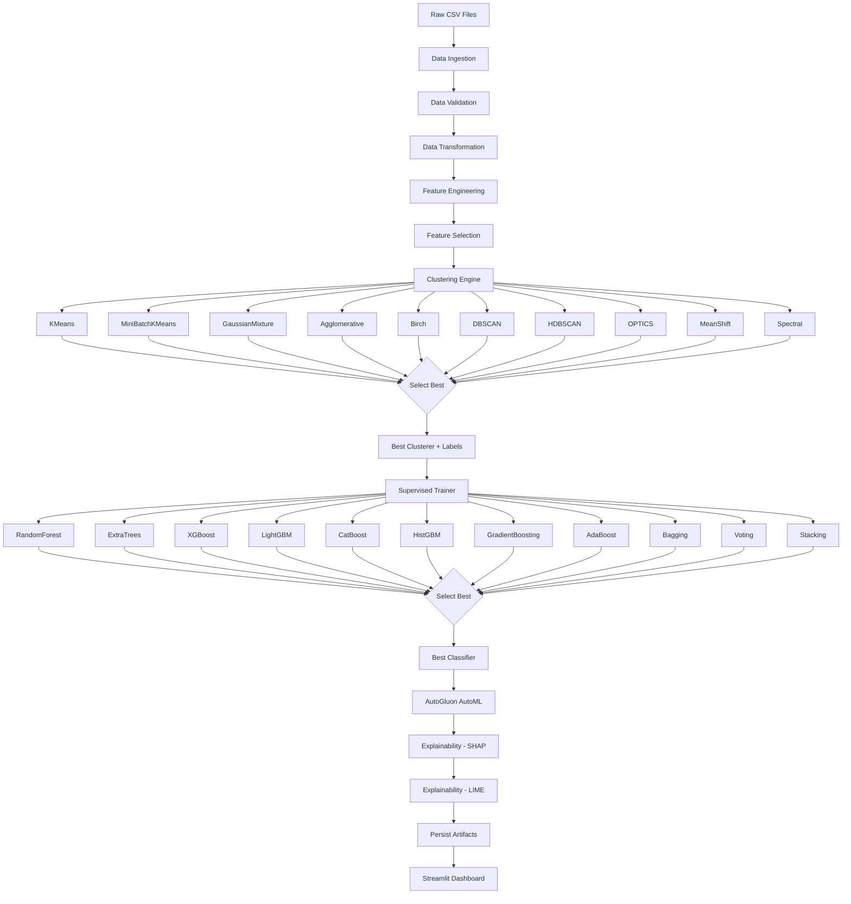
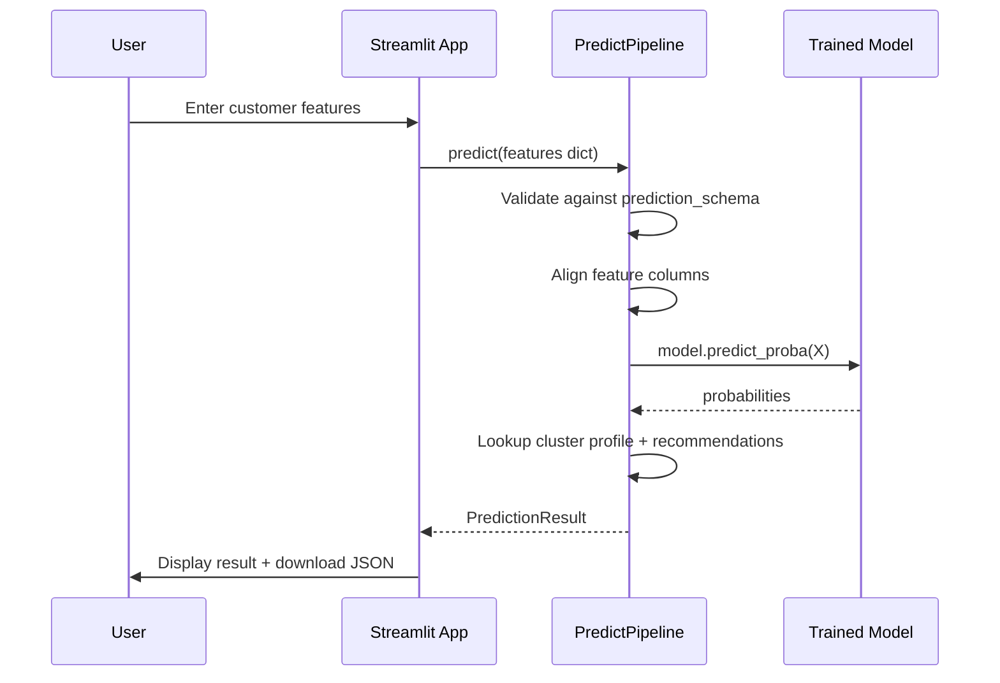

# Workflow

## End-to-End Training Workflow



## Prediction Workflow



## File Lifecycle

```
data/raw/marketing_campaign.csv     ← user-provided source
                │
                ▼
data/processed/ingested.csv         ← written by DataIngestion
                │
                ▼
data/processed/transformed.csv      ← written by DataTransformation
                │
                ▼
data/processed/engineered.csv       ← written by FeatureEngineer
                │
                ▼
data/processed/selected_features.csv ← written by FeatureSelector
                │
                ▼
data/processed/clustered.csv        ← written by ClusteringEngine
                │
                ▼
data/processed/train.csv            ← written by SupervisedModelTrainer
data/processed/test.csv             ← written by SupervisedModelTrainer
                │
                ▼
saved_models/best_classifier.joblib ← consumed by PredictPipeline
saved_models/best_clusterer.joblib
saved_models/preprocessor.joblib
saved_models/scaler.joblib
saved_models/feature_selector.joblib
saved_models/explainability/shap_values.joblib
saved_models/explainability/lime_explainer.joblib
                │
                ▼
artifacts/reports/clustering_report.json
artifacts/reports/supervised_report.json
artifacts/reports/validation_report.json
artifacts/reports/pipeline_summary.json
```
